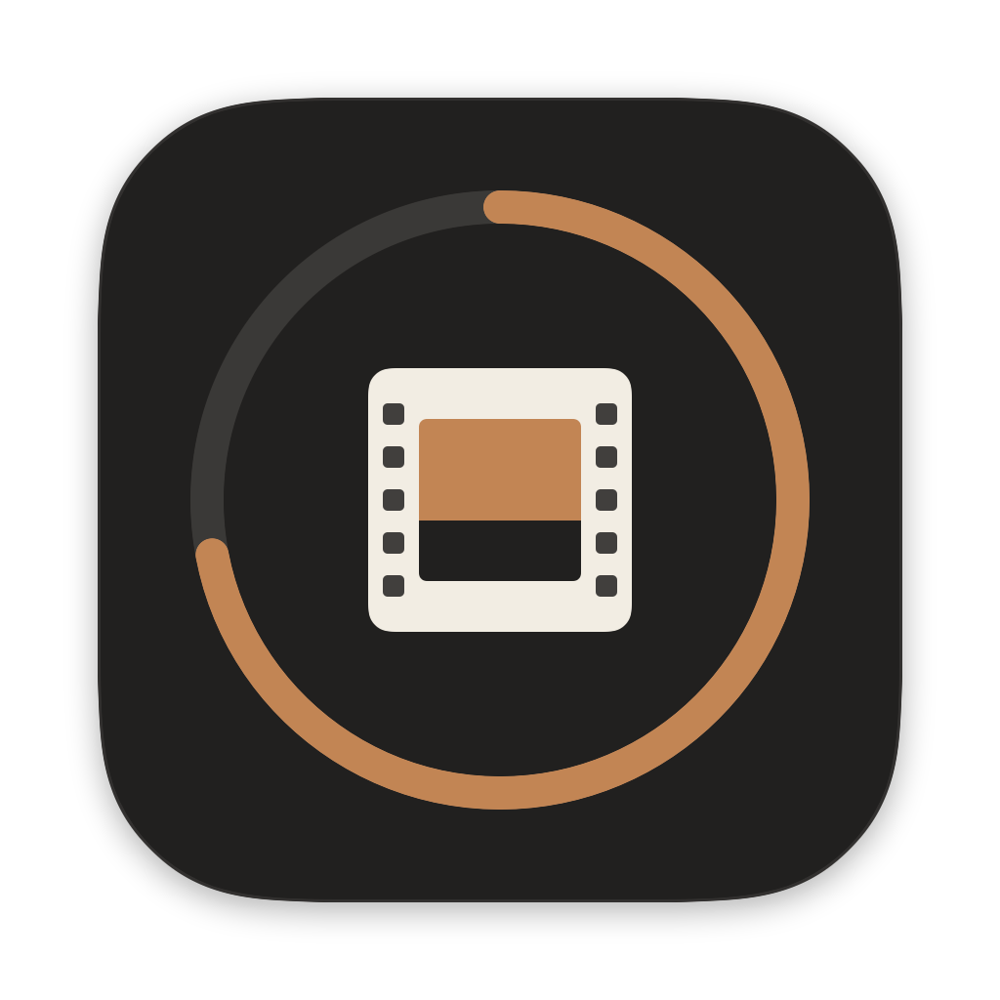
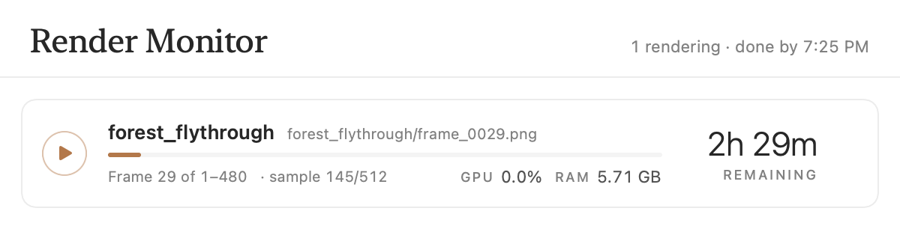
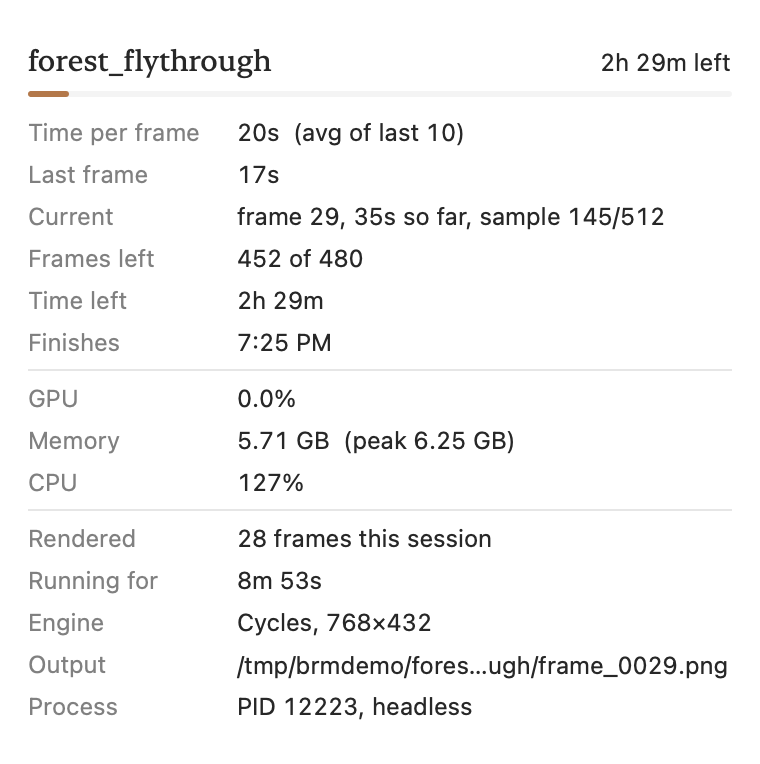
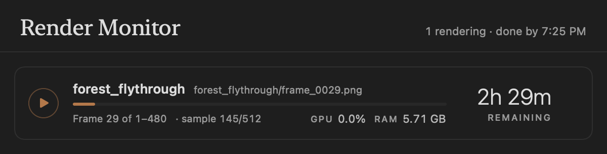

<p align="center">
  
</p>

<h1 align="center">Blender Render Monitor</h1>

<p align="center">
  A small macOS app that shows every Blender render running on your Mac, how far along it is and when it will finish.
</p>

<p align="center">
  
</p>

## Features

- **Every render in one place.** The app finds running Blender processes on its own, including headless `blender -b` renders started by scripts. You don't have to change how you launch renders.
- **Progress and time left.** Each render shows its current frame, the frame range and the estimated time remaining. The estimate uses the average of the last 10 frames, so it keeps up as shots get heavier or lighter.
- **Details on hover.** Hover over a render to see:
  - time per frame and the last frame's time
  - how long the current frame has been rendering
  - frames left, time left and the clock time it should finish
  - GPU, memory and CPU usage
  - engine, resolution and output path
- **GPU and RAM per render.** These use the same measures as Activity Monitor's "% GPU" and "Memory" columns.
- **Pause and resume.** A render freezes instantly, even mid-frame, and continues exactly where it left off. Time spent paused isn't counted in the estimates.
- **Priority queue.** Reorder renders and choose how many run at once: all of them, one, two or three. The rest wait, paused, and start automatically in order. Finish times take the queue into account.
- **Quit or force quit.** Stop a render from the app. Frames already saved stay on disk.
- **Menu bar status.** The current frame and time left appear in the menu bar, so you can close the window.
- **Light and dark mode.**

<p align="center">
  
  &nbsp;&nbsp;
  
</p>

## Requirements

- macOS 14 or later on Apple Silicon
- Blender 3.0 or later (tested with Blender 5.2)

## Install

Build the app from source. You need Apple's command-line tools (`xcode-select --install`); the full Xcode app isn't required.

```bash
git clone https://github.com/DUBSON0/blender-render-monitor.git
cd blender-render-monitor
./build.sh
open "build/Blender Render Monitor.app"
```

To keep it, drag `build/Blender Render Monitor.app` into Applications. You can add it to **System Settings → General → Login Items** to have it start with your Mac.

If you copy the built app to another Mac, macOS will block it the first time, because the app isn't notarized. Allow it under **System Settings → Privacy & Security → Open Anyway**, or run:

```bash
xattr -dr com.apple.quarantine "/Applications/Blender Render Monitor.app"
```

## How it gets render progress

Blender has no way for another app to ask about render progress, so the app uses two sources.

### Blender's log, with no setup

When a Blender process sends its output to a log file, the app follows that file. It reads the line Blender prints after each frame (`Saved: '…/frame_0042.png'` for image sequences, `Video append frame 42` for video), so it knows the current frame and how long each frame took. To get the frame range, it opens the render's `.blend` in a background Blender once and reads the scene's start and end frames.

This covers renders like:

```bash
blender -b scene.blend -a > render.log 2>&1
```

Renders whose output goes to a terminal or a pipe can't be followed this way. Use the hook for those.

### The hook script, for full detail

`blender/render_monitor.py` is a tiny script that runs inside Blender and reports each frame's start and finish. When Cycles reports it, the hook also passes along the sample count and Cycles' own estimate of the current frame's time left. The app installs a copy at:

```
~/Library/Application Support/BlenderRenderMonitor/render_monitor.py
```

Load it with `--python` before your own script or render flags. This works with `--factory-startup`, which skips add-ons:

```bash
blender -b scene.blend --python "$HOME/Library/Application Support/BlenderRenderMonitor/render_monitor.py" -a
blender -b --factory-startup scene.blend \
  --python "$HOME/Library/Application Support/BlenderRenderMonitor/render_monitor.py" \
  --python my_render_script.py
```

The toolbar's **Blender Hook** menu copies the `--python` argument for you. For renders from the Blender interface, install the same file as an add-on under **Preferences → Add-ons → Install from Disk**.

## Pausing, the queue and quitting

- **Pausing** stops the Blender process with `SIGSTOP`, and **resuming** continues it with `SIGCONT`. A paused render keeps its memory.
- **The queue** pauses renders below the "Run N at a time" limit, and resumes the next one when a slot frees up. A render joins the queue once it finishes its first frame.
- **Quitting the app** resumes every render that was only waiting in the queue, so nothing stays frozen. Renders you paused yourself stay paused.
- **Quit Render** sends `SIGTERM`, and **Force Quit** sends `SIGKILL`. The frame in progress is lost; frames already saved are kept.

## Project layout

| Path | What it is |
|---|---|
| `Sources/BlenderRenderMonitor/` | The SwiftUI app |
| `blender/render_monitor.py` | The Blender hook script, which is also an add-on |
| `icon/make_icon.swift` | Draws the app icon (`swift icon/make_icon.swift icon/AppIcon.png`) |
| `build.sh` | Builds `build/Blender Render Monitor.app` |

## Limitations

- **Estimates follow recent frames.** They come from measured frame times, so they shift when frame cost changes or when renders compete for the same GPU.
- **Totals assume the scene's frame range.** A script that renders only some frames, such as a few stills, shows the full range as the total.
- **Log-based tracking reads the `.blend` on disk.** If the file is saved with a different frame range mid-render, the total will be off.
- **GPU usage is utilization, not GPU memory.** On Apple Silicon the GPU shares system memory, so its memory is included in the RAM figure.
